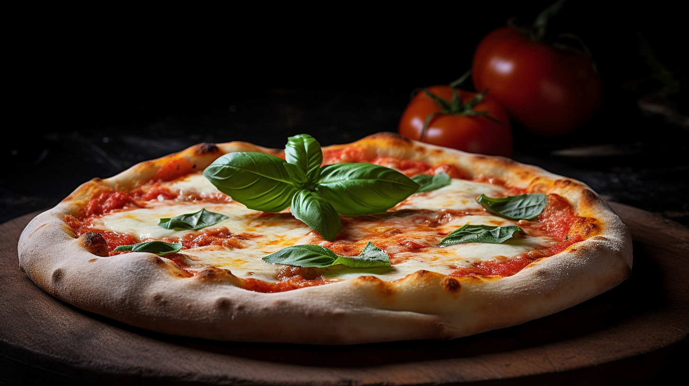

# Pizza Recipes

Welcome to the Pizza Recipes section of our repository! 🍕🍴

In this section, we invite you to explore a variety of delicious pizza recipes shared by fellow pizza enthusiasts. From classic favorites to innovative creations, you'll find inspiration to create your perfect homemade pizza. Grab your apron, preheat the oven, and let's get cooking!

## Table of Contents

- [Margherita Pizza](#margherita-pizza)
- [Pepperoni Pizza](#pepperoni-pizza)
- [4 Cheese Pizza🧀](#4-cheese-pizza )
- [Spicy Pizza sauce](#spicy-pizza-sauce)

### Margherita Pizza
A timeless classic, Margherita pizza showcases simple andfresh ingredients. The combination of tomato sauce, mozzarella cheese, and fresh basil leaves is a dependable go-to. 

### Pepperoni Pizza
A mouthwatering delight, featuring a perfect harmony of zesty pepperoni, savory cheese, and a satisfyingly crispy crust. A timeless classic that never fails to please the taste buds.

### 4 Cheese Pizza
Savor the scrumptiousness of a 4 Cheese Pizza, where four cheeses come together to create an unforgettable experience. From the gooey mozzarella to the bold cheddar, each cheese adds its distinct character to this pizza. So, if you're seeking a slice of cheesy heaven, look no further than this irresistible delight!

### Spicy Pizza Sauce
Home-made rich sensation sauce that will enchant your tongue in a burst of flavors. This combination of the sauce on any pizza will send you reeling backward in a rush of fiery delight 

# Margherita Pizza (Michelin Quality)

Experience a Michelin-quality Margherita Pizza that celebrates the essence of simplicity and exceptional ingredients. This recipe brings together the finest flavors, perfectly balanced to create a truly remarkable pizza.

## Ingredients

- 1 ball of Neapolitan-style pizza dough
- 1/2 cup San Marzano tomato sauce
- 8 ounces of buffalo mozzarella cheese (water-packed), torn into small pieces
- Handful of fresh basil leaves (Genovese or sweet basil)
- High-quality extra-virgin olive oil (cold-pressed)
- Sea salt flakes and freshly ground black pepper

## Instructions

1. Preheat a pizza stone in the oven at the highest temperature possible (around 500°F/260°C) for at least 30 minutes.

2. On a lightly floured surface, stretch the pizza dough into a round shape, keeping the center slightly thicker than the edges. Take care not to overwork the dough to maintain a light and airy crust.

3. Place the stretched dough onto a pizza peel or a floured surface covered with parchment paper.

4. Spoon the San Marzano tomato sauce onto the dough, leaving a small border around the edges. Use the back of the spoon to spread the sauce evenly.

5. Distribute the torn buffalo mozzarella pieces over the sauce, ensuring an even coverage across the pizza.

6. Tear the fresh basil leaves and scatter them on top of the cheese.

7. Drizzle a generous amount of high-quality extra-virgin olive oil over the pizza to enhance the flavors.

8. Sprinkle a pinch of sea salt flakes and freshly ground black pepper over the top, adding a touch of seasoning.

9. Slide the pizza onto the preheated pizza stone in the oven and bake for approximately 90 seconds to 2 minutes, or until the crust is beautifully charred and blistered.

10. Remove the pizza from the oven using a pizza peel or spatula, and let it rest for a minute to allow the flavors to meld.

11. Slice the Margherita Pizza and enjoy!

# Pepperoni Pizza

Pepperoni pizza, a classic favorite, tantalizes taste buds with its perfect blend of savory pepperoni and melted cheese, making every bite a delightful and satisfying experience.

## Ingredients

- Pizza dough (store-bought or homemade)
- Pizza sauce (tomato-based sauce)
- Shredded mozzarella cheese (or a blend of mozzarella and other cheeses)
- Pepperoni slices
- Olive oil (for brushing the crust, optional)
- Dried oregano (optional, for sprinkling on top)
- Red pepper flakes (optional, for added spice)

## Instructions

1. Preheat your oven: Preheat your oven to the temperature specified on the pizza dough package or to 475°F (245°C).

2. Lightly grease a pizza pan or baking sheet with cooking spray or olive oil to prevent sticking.

3. On a floured surface, roll out the pizza dough into your desired pizza size and thickness. If using store-bought dough, follow the package instructions.

4. Carefully lift the rolled-out dough and place it on the greased pizza pan. Adjust the shape if needed.

5. Spoon the pizza sauce onto the dough and spread it evenly, leaving a small border around the edges for the crust.

6. Sprinkle a generous amount of shredded mozzarella cheese over the sauce, covering the entire pizza.

7. Place the pepperoni slices on top of the cheese. You can cover the whole pizza or leave some spaces between the slices, depending on your preference.

8. If desired, drizzle a little olive oil over the pizza to add extra flavor and shine. You can also sprinkle dried oregano and red pepper flakes on top for added taste and a touch of spice.

9. Carefully transfer the pizza to the preheated oven and bake for about 12-15 minutes or until the crust is golden brown and the cheese is bubbly and slightly browned.

10. Once the pizza is done baking, remove it from the oven and let it cool for a minute or two. Then, slice it into wedges or squares, and serve hot!

# 4 Cheese Pizza

Indulge in the cheesy delight of a 4 Cheese Pizza! This delectable pizza is a fusion of four different cheeses that harmonize to create an explosion of flavors. With creamy mozzarella, tangy cheddar, savory feta, and luscious fresh mozzarella, each bite is a taste of pure bliss. Perfect for cheese lovers and pizza enthusiasts alike, this mouthwatering treat promises to be an unforgettable culinary experience.

## Ingredients

- 1 pre-made pizza dough (or homemade, if preferred)
- 1/2 cup pizza sauce (store-bought or homemade)
- 1 cup shredded mozzarella cheese
- 1/2 cup shredded cheddar cheese
- 1/2 cup crumbled feta cheese
- 1/2 cup sliced fresh mozzarella cheese
- 2 tablespoons grated Parmesan cheese
- 1 teaspoon dried oregano
- 1 teaspoon dried basil
- 1/2 teaspoon garlic powder
- Olive oil (for brushing the crust)

## Instructions

1. Preheat your oven to the recommended temperature for pizza baking (usually around 475°F or 245°C).

2. Roll out the pizza dough on a floured surface to your desired thickness. Place it on a pizza stone or a baking sheet lined with parchment paper.

3. Spread the pizza sauce evenly over the dough, leaving a small border around the edges.

4. Sprinkle the shredded mozzarella cheese, cheddar cheese, and crumbled feta cheese over the sauce, distributing them evenly.

5. Arrange the sliced fresh mozzarella cheese on top of the other cheeses.

6. Sprinkle the grated Parmesan cheese, dried oregano, dried basil, and garlic powder over the entire pizza for added flavor.

7. Brush the edges of the pizza crust with olive oil to achieve a golden-brown and crispy crust.

8. Place the pizza in the preheated oven and bake for about 12-15 minutes, or until the crust is golden and the cheese is melted and bubbly.

9. Once the pizza is ready, remove it from the oven and let it cool slightly before slicing and serving.

Enjoy the delightful taste of your homemade 4 Cheese Pizza with friends and family! It's a perfect blend of cheesy goodness that will surely leave everyone satisfied. Bon appétit!

# Spicy Pizza Sauce

Embrace this blend of flavors as you forgo store-brought sauce for this nuturious homemade masterpiece. This sauce is a tad bit sweet, spicy, and not for the faint of heart. With extra garlic to add more depth and aroma, it will redefine your pizza experience. 

## Ingredients
- 3 medium tomatoes
- 1 red bell pepper
- 2 Scotch bonnet pepper (adjust to your preferred spice level)
- 1 medium onion
- 4 tbsp tomato paste (optional)
- 5 cloves of garlic
- 2 tsp sugar
- Salt
- 1 seasoning cube
- 2 tablespoons olive oil

## Instructions
1. Chop onion, scotch bonnets, tomatoes, and seeded red bell pepper. Rinse them.

2. Blend chopped ingredients with garlic until smooth.

3. Heat oil, add tomato paste, cook till darkened and simmering.

4. Pour blended puree into oil, stir and simmer.

5. Add sugar, salt, and seasoning cube. Adjust taste, stir to prevent burning.

6. Cook for 30 mins, adjust water if thick.

7. Let it cool. Your pizza sauce is ready to use.
   
## Nigeria pizza

The first experience with this snack might taste strange, especially for those without Nigerian tastebuds lol! 😁 But not to worry, with time you will get used to the taste and will start running back for more! 😁
The best thing about this pizza is that any food item can be used as its topping as long as the combo pleases you.
## Ingredients
The following ingredients are needed for a 12-inch diameter pizza.

### Pizza Dough
The following quantities of ingredients make a chunky pizza crust. If you want a slender pizza crust but still 12 inches diameter, use half the quantities of ingredients.

- 300g plain flour 
- 3g or 2 teaspoons yeast
- Four tablespoons olive oil
- 150ml of warm water
- One teaspoon of salt
- One teaspoon of sugar
- Margarine (for the oven tray)

*For the toppings*
- 250g Mozzarella cheese
- Four table spoons of Tomato stew
- Two mushrooms
- One tablespoon of minced/ground meat
- Red bell pepper
- Green bell pepper
- Two tablespoons of olive oil

## Instructions
- Mix the pizza dough

1. Sieve the plain flour into a clean dry bowl. The bowl should be large enough for mixing the flour and other ingredients. Why it is required to sift the flour is because it airs the flour and breaks up any available lumps making it easier to mix.
2. Add the yeast to the dry flour and stir to mix. This is important so the salt which is added next does not touch the yeast.
3. Put in the sugar and salt and mix thoroughly
4. Then add the olive oil and mix thoroughly
5. Begin adding the warm water and mix up with a spatula at the same time till all the water has been engrossed. Then continue by hand till even soft dough is achieved. Fold up the dough and lay it in the bowl.
6. Cover the bowl with a thin plastic film/warm towel and place in a warm place for an hour for the dough to rise. You can place it in a turned off oven that can serve as a warm place.

*Prepare the oven tray*
Usually, Pizza is laid on a pizza stone and baked in a clay oven, there are mostly used by those living but unless you live in a beautiful Italian countryside, what most of us have is a standard kitchen oven.
And you most probably do not have a pizza stone.
The Pizza will be placed in an oven tray and bake it in a standard kitchen oven.

## Instructions 
1. Rub some margarine in the oven tray, ensure that every part of the tray is covered with a thin layer of margarine. Soft butter can be an alternative here
2. Sprinkle some flour on it; ensure that the flour covers all the margarine. When done, pour out the excess flour.

*Continue with the Pizza dough*
## Instructions
7. After an hour, bring out the Pizza dough from the warm place. You’ll observe that the pizza dough is swollen.
8. Knead it for a bit and move it to the oven tray.
9. In circular motion, spread the dough until it is 12 inches in diameter. The dough may resist as you do this but continue you can get the dough to spread as wide as possible.
10. After that, cover the dough and place in a warm place to rise yet again for 45 minutes.

*Prepare the Pizza toppings*
## Instructions
1. While waiting for the Pizza dough to rise a second time, go on and wash the vegetables use for the pizza topping , slice them and set aside
2. Fry the minced beef in a little quantity of vegetable oil until it turns pale.
3. Get the tomato sauce ready for the pizza. Here we made use of stock cube, onion powder and salt and some Tomato Stew i.e fresh tomato puree fried in vegetable oil. Add the stock cube, onion powder and salt to the vegetable oil. You can also add any ingredient of your choice.

*Back to the Pizza dough*
## Instructions
11. Its 45 minutes already and by now the pizza dough must have puffed up again. Bring it out from its warm place and spread it out more to manipulate it again
12. Spread some quantity of the olive oil on the dough.
13. Spread the tomato sauce.
14. Then sprinkle the cheese on top.

*Bake and enjoy!*
## Instructions
1. Place the pizza in a preheated oven (180°C or 360F) and bake for 20-25 minutes or till the pizza crust is light brown and the cheese has turned watery by the heat.
2. The pizza should be removed from the oven and place the rest of the toppings on top.
3. Place it back in the oven and bake for a maximum of 2 minutes; of course you do not want the vegetables to become dull.

Pizza can be serve with a chilled soft drink. 
