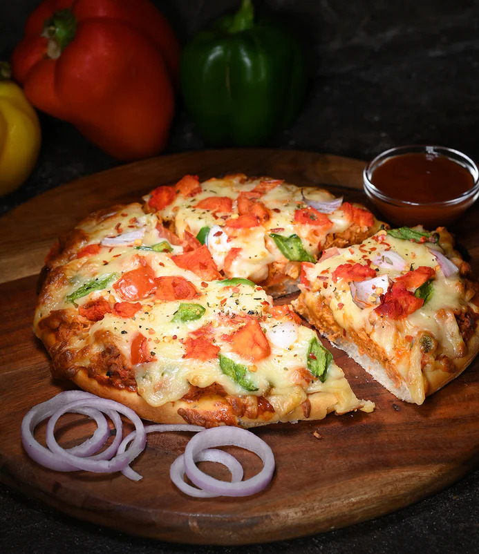

# Pizza Recipes

Welcome to the Pizza Recipes section of our repository! 🍕🍴

In this section, we invite you to explore a variety of delicious pizza recipes shared by fellow pizza enthusiasts. From classic favorites to innovative creations, you'll find inspiration to create your perfect homemade pizza. Grab your apron, preheat the oven, and let's get cooking!

## Table of Contents

- [Margherita Pizza](#margherita-pizza)
- [Pepperoni Pizza](#pepperoni-pizza)
- [4 Cheese Pizza🧀](#4-cheese-pizza )
- [Spicy Pizza sauce](#spicy-pizza-sauce)
- [Nigeria pizza](#nigeria-pizza)
- [Chicken Tikka Masala Pizza](#chicken-tikka-masala-pizza)
- [Old Forge Double Crust Stuffed White Pizza](#old-forge-double-crust-stuffed-white-pizza)

### Margherita Pizza
A timeless classic, Margherita pizza showcases simple and fresh ingredients. The combination of tomato sauce, mozzarella cheese, and fresh basil leaves is a dependable go-to. 

### Pepperoni Pizza
A mouthwatering delight, featuring a perfect harmony of zesty pepperoni, savory cheese, and a satisfyingly crispy crust. A timeless classic that never fails to please the taste buds.

### 4 Cheese Pizza
Savor the scrumptiousness of a 4 Cheese Pizza, where four cheeses come together to create an unforgettable experience. From the gooey mozzarella to the bold cheddar, each cheese adds its distinct character to this pizza. So, if you're seeking a slice of cheesy heaven, look no further than this irresistible delight!

### Spicy Pizza Sauce
Home-made rich sensation sauce that will enchant your tongue in a burst of flavors. This combination of the sauce on any pizza will send you reeling backward in a rush of fiery delight 

### Nigeria pizza
Nigerian Pizza is a thinly rolled bread dough crust, typically topped before baking with tomato sauce, cheese, and other ingredients such as meat, vegetables, or fruit.

### Chicken Tikka Masala Pizza
Chicken Tikka Masala Pizza is a cheesy Indian pizza topped with delicious chicken tikka masala. It is the best and easiest homemade pizza recipe ever.

### Old Forge Double Crust Stuffed White Pizza
Old Forge Double Crust White Pizza is something native to Northeast Pennsylvania. NEPA (Where I’m from) has so many different types of pizza. Also known as “Stuffed Pizza” to some, this pizza is essentially a giant (and delicious) grilled cheese sandwich!  It is flavorful to the extreme, great for gatherings and parties, and very versatile.  It also happens to be very easy to make from simple ingredients from the grocery store.

# Margherita Pizza (Michelin Quality)

Experience a Michelin-quality Margherita Pizza that celebrates the essence of simplicity and exceptional ingredients. This recipe brings together the finest flavors, perfectly balanced to create a truly remarkable pizza.

## Ingredients

- 1 ball of Neapolitan-style pizza dough
- 1/2 cup San Marzano tomato sauce
- 8 ounces of buffalo mozzarella cheese (water-packed), torn into small pieces
- Handful of fresh basil leaves (Genovese or sweet basil)
- High-quality extra-virgin olive oil (cold-pressed)
- Sea salt flakes and freshly ground black pepper

## Instructions

1. Preheat a pizza stone in the oven at the highest temperature possible (around 500°F/260°C) for at least 30 minutes.

2. On a lightly floured surface, stretch the pizza dough into a round shape, keeping the center slightly thicker than the edges. Take care not to overwork the dough to maintain a light and airy crust.

3. Place the stretched dough onto a pizza peel or a floured surface covered with parchment paper.

4. Spoon the San Marzano tomato sauce onto the dough, leaving a small border around the edges. Use the back of the spoon to spread the sauce evenly.

5. Distribute the torn buffalo mozzarella pieces over the sauce, ensuring an even coverage across the pizza.

6. Tear the fresh basil leaves and scatter them on top of the cheese.

7. Drizzle a generous amount of high-quality extra-virgin olive oil over the pizza to enhance the flavors.

8. Sprinkle a pinch of sea salt flakes and freshly ground black pepper over the top, adding a touch of seasoning.

9. Slide the pizza onto the preheated pizza stone in the oven and bake for approximately 90 seconds to 2 minutes, or until the crust is beautifully charred and blistered.

10. Remove the pizza from the oven using a pizza peel or spatula, and let it rest for a minute to allow the flavors to meld.

11. Slice the Margherita Pizza and enjoy!

# Pepperoni Pizza

Pepperoni pizza, a classic favorite, tantalizes taste buds with its perfect blend of savory pepperoni and melted cheese, making every bite a delightful and satisfying experience.

## Ingredients

- Pizza dough (store-bought or homemade)
- Pizza sauce (tomato-based sauce)
- Shredded mozzarella cheese (or a blend of mozzarella and other cheeses)
- Pepperoni slices
- Olive oil (for brushing the crust, optional)
- Dried oregano (optional, for sprinkling on top)
- Red pepper flakes (optional, for added spice)

## Instructions

1. Preheat your oven: Preheat your oven to the temperature specified on the pizza dough package or to 475°F (245°C).

2. Lightly grease a pizza pan or baking sheet with cooking spray or olive oil to prevent sticking.

3. On a floured surface, roll out the pizza dough into your desired pizza size and thickness. If using store-bought dough, follow the package instructions.

4. Carefully lift the rolled-out dough and place it on the greased pizza pan. Adjust the shape if needed.

5. Spoon the pizza sauce onto the dough and spread it evenly, leaving a small border around the edges for the crust.

6. Sprinkle a generous amount of shredded mozzarella cheese over the sauce, covering the entire pizza.

7. Place the pepperoni slices on top of the cheese. You can cover the whole pizza or leave some spaces between the slices, depending on your preference.

8. If desired, drizzle a little olive oil over the pizza to add extra flavor and shine. You can also sprinkle dried oregano and red pepper flakes on top for added taste and a touch of spice.

9. Carefully transfer the pizza to the preheated oven and bake for about 12-15 minutes or until the crust is golden brown and the cheese is bubbly and slightly browned.

10. Once the pizza is done baking, remove it from the oven and let it cool for a minute or two. Then, slice it into wedges or squares, and serve hot!

# 4 Cheese Pizza

Indulge in the cheesy delight of a 4 Cheese Pizza! This delectable pizza is a fusion of four different cheeses that harmonize to create an explosion of flavors. With creamy mozzarella, tangy cheddar, savory feta, and luscious fresh mozzarella, each bite is a taste of pure bliss. Perfect for cheese lovers and pizza enthusiasts alike, this mouthwatering treat promises to be an unforgettable culinary experience.

## Ingredients

- 1 pre-made pizza dough (or homemade, if preferred)
- 1/2 cup pizza sauce (store-bought or homemade)
- 1 cup shredded mozzarella cheese
- 1/2 cup shredded cheddar cheese
- 1/2 cup crumbled feta cheese
- 1/2 cup sliced fresh mozzarella cheese
- 2 tablespoons grated Parmesan cheese
- 1 teaspoon dried oregano
- 1 teaspoon dried basil
- 1/2 teaspoon garlic powder
- Olive oil (for brushing the crust)

## Instructions

1. Preheat your oven to the recommended temperature for pizza baking (usually around 475°F or 245°C).

2. Roll out the pizza dough on a floured surface to your desired thickness. Place it on a pizza stone or a baking sheet lined with parchment paper.

3. Spread the pizza sauce evenly over the dough, leaving a small border around the edges.

4. Sprinkle the shredded mozzarella cheese, cheddar cheese, and crumbled feta cheese over the sauce, distributing them evenly.

5. Arrange the sliced fresh mozzarella cheese on top of the other cheeses.

6. Sprinkle the grated Parmesan cheese, dried oregano, dried basil, and garlic powder over the entire pizza for added flavor.

7. Brush the edges of the pizza crust with olive oil to achieve a golden-brown and crispy crust.

8. Place the pizza in the preheated oven and bake for about 12-15 minutes, or until the crust is golden and the cheese is melted and bubbly.

9. Once the pizza is ready, remove it from the oven and let it cool slightly before slicing and serving.

Enjoy the delightful taste of your homemade 4 Cheese Pizza with friends and family! It's a perfect blend of cheesy goodness that will surely leave everyone satisfied. Bon appétit!

# Spicy Pizza Sauce

Embrace this blend of flavors as you forgo store-brought sauce for this nuturious homemade masterpiece. This sauce is a tad bit sweet, spicy, and not for the faint of heart. With extra garlic to add more depth and aroma, it will redefine your pizza experience. 

## Ingredients
- 3 medium tomatoes
- 1 red bell pepper
- 2 Scotch bonnet pepper (adjust to your preferred spice level)
- 1 medium onion
- 4 tbsp tomato paste (optional)
- 5 cloves of garlic
- 2 tsp sugar
- Salt
- 1 seasoning cube
- 2 tablespoons olive oil

## Instructions
1. Chop onion, scotch bonnets, tomatoes, and seeded red bell pepper. Rinse them.

2. Blend chopped ingredients with garlic until smooth.

3. Heat oil, add tomato paste, cook till darkened and simmering.

4. Pour blended puree into oil, stir and simmer.

5. Add sugar, salt, and seasoning cube. Adjust taste, stir to prevent burning.

6. Cook for 30 mins, adjust water if thick.

7. Let it cool. Your pizza sauce is ready to use.
   
## Nigeria pizza

The first experience with this snack might taste strange, especially for those without Nigerian tastebuds lol! 😁 But not to worry, with time you will get used to the taste and will start running back for more! 😁
The best thing about this pizza is that any food item can be used as its topping as long as the combo pleases you.
## Ingredients
The following ingredients are needed for a 12-inch-diameter pizza:

NOTE: If you want a slender pizza crust but still 12 inches in diameter, use half the quantities of ingredients.

- 300g plain flour 
- 3g or 2 teaspoons yeast
- Four tablespoons olive oil
- 150ml of warm water
- One teaspoon of salt
- One teaspoon of sugar
- Margarine (for the oven tray)

## Pizza Toppings
- 250g Mozzarella cheese
- Four tablespoons of Tomato stew
- Two mushrooms
- One tablespoon of minced/ground meat
- Red bell pepper
- Green bell pepper
- Two tablespoons of olive oil

## Pizza Crust
### Mix the pizza dough
1. Sieve the plain flour into a clean, dry bowl. The bowl should be large enough for mixing the flour and other ingredients. It is required to sift the flour because it airs the flour and breaks up any available lumps, making it easier to mix.
2. Add the yeast to the dry flour and stir to mix. This is important so the salt, which is added next, does not touch the yeast.
3. Put in the sugar and salt and mix thoroughly
4. Add the olive oil and mix thoroughly
5. Begin adding the warm water and mix it up with a spatula at the same time till all the water has been engrossed. Then continue by hand till even soft dough is achieved. Fold up the dough and lay it in the bowl.
6. Cover the bowl with a thin plastic film or warm towel and place it in a warm place for an hour for the dough to rise. You can place it in a turned-off oven that can serve as a warm place.

## Prepare the oven tray
Place the pizza in an oven tray. If you happen to have a pizza stone, feel free to use that instead.
The pizza will be placed in an oven tray and baked in a standard kitchen oven.

### Instructions 
1. Rub some margarine in the oven tray, and ensure that every part of the tray is covered with a thin layer of margarine. Soft butter can be an alternative here
2. Sprinkle some flour on it; ensure that the flour covers all the margarine. When done, pour out the excess flour.

## Continue with the Pizza dough 
### Instructions
7. After an hour, bring out the pizza dough from the warm place. The pizza dough will look swollen.
8. Knead it for a bit and move it to the oven tray.
9. In a circular motion, spread the dough until it is 12 inches in diameter. The dough may resist as you do this but continue you can get the dough to spread as wide as possible.
10. Cover the dough and place it in a warm place to rise yet again for 45 minutes.

## Prepare the Pizza toppings
### Instructions 
1. While waiting for the Pizza dough to rise a second time, go on and wash the vegetables used for the pizza topping, slice them, and set aside
2. Fry the minced beef in a small quantity of vegetable oil until it turns pale.
3. Get the tomato sauce ready for the pizza. Here we made use of stock cube, onion powder salt, and some Tomato stews i.e. fresh tomato puree fried in vegetable oil. Add the stock cube, onion powder, and salt to the vegetable oil. You can also add any ingredient of your choice.

## Back to the Pizza dough
### Instructions
1. Bring out the puffed dough from the oven and spread it out more to manipulate it again
2. Spread some more olive oil on the dough.
3. Add the tomato sauce.
4. Sprinkle the cheese on top.

## Back to Baking!
### Instructions
1. Place the pizza in a preheated oven (180°C or 360F) and bake for 20-25 minutes or till the pizza crust is light brown and the cheese has turned watery by the heat.
2. The pizza should be removed from the oven and place the rest of the toppings on top.
3. Place it back in the oven and bake for a maximum of 2 minutes; of course, you do not want the vegetables to become dull.

Enjoy with a chilled soft drink.

# Chicken Tikka Masala Pizza 

This is an easy and delicious pizza recipe. It’s full of those classic tikka masala flavors that you know and love. The exotic flavors of chicken tikka masala pair wonderfully with the ooey-gooey cheesiness of a pizza. It’s an incredible combination of spices and rich cheese. Although this recipe has a long list of ingredients, it’s worth it and It’s not difficult to make.

## Ingredients

- Pizza dough (store-bought or homemade)
- 10 oz. skinless and boneless chicken breast (cut into 1/2-inch cubes)
- 1 tablespoon butter
- 2 cloves garlic (minced)
- 1/2 jalapeno (deseeded)
- Salt to taste
- 1 12- inches store-bought pizza crust or three (3 7-inches mini pizza crusts)
- Olive oil for brushing
- 1/4 onion (thinly sliced)
- 1 cup mozzarella cheese
- Handful of coriander leaves/cilantro (chopped, save some for garnish)

## Marinade

- 1/2 teaspoon ground cumin
- 1/2 teaspoon ground cayenne pepper
- 1/2 teaspoon ground garam masala
- 1/2 teaspoon minced fresh ginger
- 1/4 teaspoon salt
- 1/4 teaspoon ground black pepper
- 1 tablespoon lemon juice
- 2 tablespoons plain yogurt
- 1 pinch cinnamon

## Tomato Sauce

- 4 oz. tomato sauce
- 2 tablespoons plain yogurt
- 2 tablespoons heavy cream

## Spice Mix
- 1/2 teaspoon cumin
- 1/2 teaspoon paprika
- 1/2 teaspoon garam masala

## Instructions

1. In a bowl, add the marinade's ingredients to the chicken, combine them together, and let the chicken marinade in the refrigerator for at least an hour.

2. Line a layer of aluminum foil in a baking pan for grilling. Spread the marinated chicken in a single layer on the pan and pour the remaining marinade on the chicken. Grill the chicken at 450°F (232°C) for 6-7 minutes, turning at half time.

3. While the chicken is cooking, prepare the tomato sauce and spice mix in separate bowls. Remove the chicken from the pan when it is done and discard the juice.

4. Heat a small saucepan and melt the butter. Sauté the garlic and jalapeno until aromatic. Pour in the spice mix and sauté until fragrant, about 1-2 minutes on medium heat. Remove the jalapeno and discard. 

5. Add in the tomato sauce and stir well to mix. Sprinkle salt to taste and continue to simmer until the sauce thickens, another 2 minutes. Turn off the heat and add the chicken into the sauce and mix well.

6. Pre-heat the oven to 450°F (232°C). Place the pizza crust on a pizza pan and brush lightly with olive oil. Spread the sauce/gravy on the pizza crust. Sprinkle 1/2 cup of cheese. Arrange the chicken on the pizza. Top it with the sliced onions, chopped cilantro and the remaining cheese.

7.Reduce the temperature to 425°F (218°C). Bake the pizza for 8-10 minutes. Remove the pizza from the pan when it is done and garnish the remaining chopped cilantro.

 **Note:** Bake according to the instructions on your store-bought pizza crust. Depending on the type of crusts you buy, the time and temperature may be slightly different. If you prefer, you can stir-fry the chicken instead of grilling it.

# Old Forge Double Crust Stuffed White Pizza

Old Forge Double Crust White Pizza is something native to Northeast Pennsylvania. NEPA (Where I’m from) has so many different types of pizza. Also known as “Stuffed Pizza” to some, this pizza is essentially a giant (and delicious) grilled cheese sandwich!  It is flavorful to the extreme, great for gatherings and parties, and very versatile. It also happens to be very easy to make from simple ingredients from the grocery store.

## Tools Needed

1. Pizza Pan or Cookie Sheet.

2. Pizza Cutter.

3. Cheese Shredder.

## Ingredients

- 2 pieces of premade Pizza Dough 16 oz each – you can make your own, really any recipe can work for this.  The amount of dough you use will depend on the size of your pan and the desired thickness.

- Cheese 16 oz to 32 oz – I prefer any combination of brick, mozzarella, cheddar, and Cooper cheeses shredded and blended in equal parts.  Some like to use American, muenster, and other cheeses.  Your imagination is really the limit here!  Use as much or as little cheese as you like, but I wouldn’t recommend going over 2 lbs as it will be difficult to eat!

- Olive Oil 2 to 3 tablespoons – Olive oil is used to coat the top crust to give it some extra flavor, color, and crispiness.

- Seasonings – I like to season the cheese inside with granulated garlic, black pepper, and oregano.  I generally use the same granulated garlic, black pepper, and oregano on top as well but always add ground/crushed rosemary to add aroma and flavor that works perfectly.  You can use any seasoning you like.

- Crisco, Lard, or Butter – this is used to coat the pan before making the pizza so that it doesn’t stick, has more flavor, and is crispy. If you have a non-stick pan and want to skip this for health or preference, you don’t really need it.

- Toppings (Optional) – thinly sliced onions placed on top of the crust are the most popular topping on this pizza.  You can add really anything inside the crust.  Broccoli, tomato, onions, spinach, peppers, steak, sausage, and pepperoni are all great to add.

## Instructions: How to Make the Double Crust White Pizza

1. Prep the Pan and Dough.

2. Preheat the oven to 450 degrees.

3. Grease the pan with shortening, lard, or butter. I like solids, not oils because they are more tacky and help pin the dough in the corners and sides so the dough doesn’t “snap back” and shrink.

3. Roll Out the first Dough and Put in the Pan. Always use room-temperature dough for this step.  Take it out of the fridge for 30 to 60 minutes before using. You can use your hands or a rolling pin to press out the dough on the counter to a size just a tiny bit smaller than the size of the pan. 

4. Carefully lift up the dough and fit it into the pan, pressing it lightly and evenly into the sides and corners of the pan. If the dough shrinks and pulls away from the sides of the pan, cover with plastic wrap and allow to sit for 15 minutes, then come back and press it out to the edges.

5. Add the Cheese. You’ll want to add a generous amount of cheese to the pizza. Although amounts will differ by pan and preference, I like to have a 1-inch high flat pile of cheese uniformly spread across the pizza leaving about 1 finger-width (1/2 inch or so) from the edge of the pan.

7. Season the Cheese.  Using the seasonings from the list above, sprinkle seasoning on the cheese. This is an important step as it provides flavor to what will be a very thick and heavy pizza.

8. Get Cheesy and Add Second Crust.

9. Roll Out the second dough and cover the pizza. Using the same process as in step 3, roll out the dough to just about the size of the pan and lift and set on top of the cheese. Pull out the corners of the dough and stick them to the bottom dough first. Then pull out the sides and stick them to the bottom dough going around the whole perimeter until the whole top is stuck to the bottom dough. Pinch a hole in the center of the top crust to allow air to be released. Use the handle of a pizza cutter (or serving spoon, or other similar kitchen tool) to press down the edge crust.

10. Brush with Oil and Season. Drizzle oil oil on top and spread with clean hands or a basting brush. You want to use just enough to where the whole crust is covered and shiny, but there should not be any excess pooling of oil.

11. Sprinkle seasonings on top.

## Bake and Enjoy

1. Bake at 450 degrees. Many recipes post the baking time for pizzas, I choose not to because I find every oven is different and the size and thickness of the pizza you will be preparing will vary. This pizza will take somewhere between 18 and 22 minutes to bake.

2. Look for 2 things to ensure that it is done: the crust has a deep golden brown color, and the cheese can be visibly bubbling through the small hole that you pinched in the top of the crust in step 6.

3. Rotate the pizza after 10 minutes of baking to ensure that it browns and cooks evenly.

4. ENJOY!

