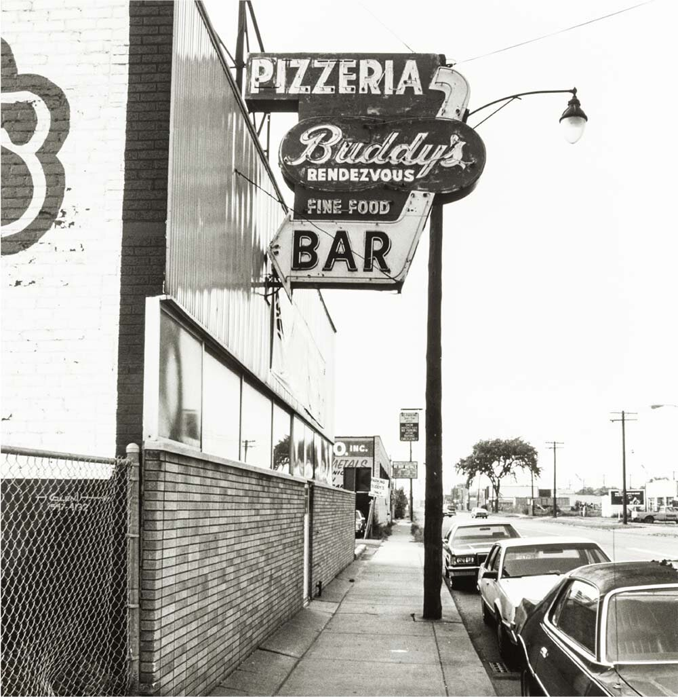

# Regional Pizza

Welcome to the Regional Pizza section of our repo! 🍕📚

We created this repo into different sections to so we can learn more about each other. If your hometown or country has a special pizza recipe or fact and want to share it, feel free to contribute to this repository and help us expand our knowledge of pizza!

## Ohio Valley Pizza

Ohio Valley pizza, also known as Steubenville-style pizza or cold-topping pizza, is a unique style of pizza that originates from the Ohio Valley region, particularly Steubenville, Ohio. Here are some key characteristics of Ohio Valley pizza:

- Baked Crust First: Unlike traditional pizzas where toppings are added before baking, Ohio Valley pizza is first baked with just the crust and tomato sauce.
- Cold Toppings: After the crust and sauce are baked, cold toppings like cheese, pepperoni, and other desired ingredients are added on top. The heat from the crust slightly melts the cheese, but the toppings largely remain cold or at room temperature.
- Rectangular Shape: Typically rectangular in shape and often sold by the slice.
- Crispy Crust: The crust is usually chewy and crispy, providing a nice contrast to the cold toppings.
  Served Immediately: Due to its unique preparation method, Ohio Valley pizza is best enjoyed immediately after it's made to experience the contrast of hot crust and cold toppings.

This style of pizza is beloved by many in the Ohio Valley region and has a dedicated following. It offers a different pizza-eating experience, with the juxtaposition of hot and cold elements in every bite.

## New York City

New York City has had a major influence on the perception of pizza for decades. Here are the key characteristics of this iconic style of pizza:

- Hand-tossed crust: This thin, crispy crust is made with high-gluten flour and stretched by hand to create a soft, bubbly interior.
- Sweet sauce: The sauce is typically made with canned tomatoes, olive oil, garlic, sugar, and herbs. The sugar helps to balance out the acidity of the tomatoes.
- Foldable slices: New York-style pizza is typically cut into eight large, triangular slices that are easy to eat on the go.
  Coal-fired oven: New York-style pizza is traditionally cooked in a coal-fired oven, but gas ovens are also commonly used.

Whether it's shown being devoured by the Teenage Mutant Ninja Turtles or used by Spiderman as a prop, this style of pizza would always be deemed as one of the symbols of New York City.

## Mochi Teriyaki Chicken Pizza (from Japan)

Pizza is popular in Japan too. You can try both classic and Japanese-style pizzas from Pizza chain restaurants. Mochi Teriyaki Chicken Pizza is one of the Japanese-style pizzas. Mochi(rice cake) topping gives a distinctive texture to a pizza.

### Toppings

- Teriyaki Chicken
- Mochi (Rice Cake)
- Corn
- Onions
- Mayonnaise
- Cheese
- Nori Flakes

## Buddy's Pizza

Buddy's Pizza is the **ORIGINAL** Detroit Style pizza. Started at the famous Buddy's Rendezvous located at 6 Mile & Conant in Detroit, Michigan by Gus Guerra and team in 1946. From the Buddy's Pizza website.

> The style flips traditional pizza on its head by beginning with double proofed dough perfectly fit to a square pan – a process that allows the dough to rise and be stretched twice – followed by the backwards layering of toppings.
>
> [USA Today](https://www.usatoday.com/story/travel/columnist/greatamericanbites/2018/10/17/pizza-regional-styles/1666339002/) called Buddy’s Pizza “Pilgrimage-worthy pizza” and [The Daily Meal](https://www.thedailymeal.com/eat/101-best-pizzas-america-2020/slide-97) named it #6 of the 101 Best Pizzas in America.
>
> The pepperoni is placed directly on the dough allowing the rich flavors of the meat to be absorbed into the crust. Next, crumbled Wisconsin brick cheese – a proprietary blend created just for Buddy’s – is sprinkled across the pie before the other toppings. Finally, to finish off the unique look, three wide stripes of sauce are skimmed across the top of the pizza before being baked to perfection.

Buddy's is a staple in the Detroit community when it comes to pizza!

### The OG Detroit

- Pepperoni
- Sauce
- Cheese
