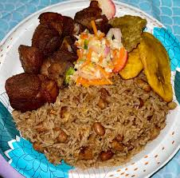
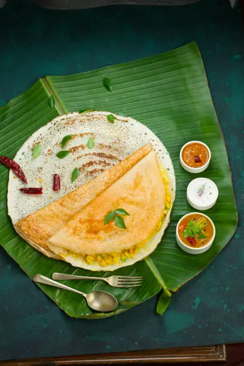
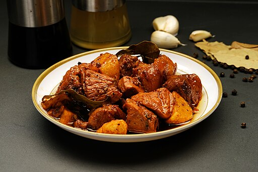

<!-- CONTRIBUTING INSTRUCTIONS -->

<!--
1. If the country name is not available, add it to the continent section, e.g., ### Country Name. Then, add the country as a list under the continent in the Table of Contents. NOTE: Country names should be ordered alphabetically.

2. Add the food to the country section, e.g., #### Food Name

3. If available, add an image to the images folder. Put the path to the image or the link to the image URL in the "src" attribute. Then, add it below the food's description. For example:

   

-->

## Table of Contents

- [Table of Contents](#table-of-contents)
- [North America](#north-america)
- [South America](#south-america)
- [Europe](#europe)
- [Africa](#africa)
- [Caribbean](#caribbean)
  - [Haiti](#haiti)
    - [Griot](#griot)
- [Asia](#asia)
  - [India](#india)
    - [Dosa](#dosa)
  - [Indonesia](#indonesia)
    - [Rendang](#rendang)
  - [Philippines](#philippines)
    - [Adobong Manok](#adobong-manok)
- [Australia / Oceania](#australia--oceania)

## North America

## South America

## Europe

## Africa

## Caribbean

### Haiti

#### Griot

Griot (pronounced "gree-oh") is a popular Haitian dish. It is pork marinated in a mixture of herbs and spices and fried in oil, resulting in a crispy and tender meat, and the sauce is rich and flavorful. Griot is often topped with a pickled vegetable sauce called "pikliz"(pronounced "pick-leez") and served along side with fried plantains, rice, and red beans, making it the national dish of Haiti.

 

## Asia

### India  

#### Dosa  

Dosa is a delicious and popular South Indian dish. It is a thin, crispy crepe made from fermented rice and lentil batter. Dosa has many variations, like egg dosa, stuffed dosa, onion dosa, etc. This dish is typically served with _sambar_ (a lentil stew) and coconut or peanut chutney.  

### Indonesia

#### Rendang

Rendang is a dish that originated in West Sumatra, Indonesia. It is a rich meat-based dish that is slow-cooked, braised in coconut milk, and seasoned with herb and spice mixture over a period of several hours. As the liquids evaporate, the meat turns dark brown and tender, caramelizing and infusing it with rich flavours.

Rendang is traditionally served at ceremonial occasions to honour guests during festive events, such as wedding feasts and Lebaran (Indonesian popular words for both Eid al-Fitr and Eid al-Adha).

### Philippines

#### Adobong Manok

Adobong manok, or "chicken adobo," is widely regarded to be the national dish of the Philippines. The beauty of chicken adobo is not just the savory flavors of the dish but also how simple and easy it is to prepare. 

Every cook might have their own methods for cooking but the recipe typically require only a few basic ingredients that are commonly available in most kitchens: vinegar, soy sauce, black peppercorns, and bay leaves. 

The cooking process usually involves marinating the chicken in a mixture of these ingredients in a pot for a short period. After marinating, the chicken is simmered in the marinade until tender. This dish is traditionally served with steamed rice or garlic fried rice.

**Image source:** Joy D. Ganaden, CC BY-SA 4.0 <https://creativecommons.org/licenses/by-sa/4.0>, via Wikimedia Commons

## Australia / Oceania
